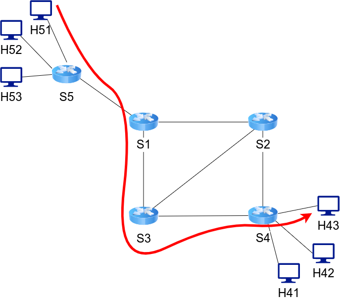
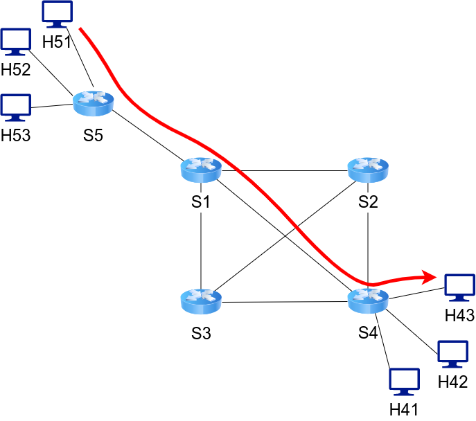

# P4 load balancer
- P4: a domain-specific language for data plane manipulation

This practice is to implement a P4 packet forwarding idea with self-defined protocol, which is source routing strategy, with load balance.  
The main goal of this practice is to complete a self-adjust packet forwarding strategy using P4.

## How to start
1. The environment configuration follows the [official P4 tutorial](https://github.com/p4lang/tutorials), installed using VirtualBox and Vagrant
2. Clone this repository to `tutorials/exercises/` by
```
p4@p4:~/tutorials/exercises $ git clone https://github.com/bboyleonp666/P4LB.git
```
3. Generate topology and start the mininet
```
p4@p4:~/tutorials/exercises/P4LB $ make myrun
```
4. In mininet, start hosts terminals
```
mininet> xterm h11 h21
```
5. Set `h11` as a receiver
```
p4@p4:~/tutorials/exercises/P4LB # ./receive.py
```
6. Send packet from `h21`
```
p4@p4:~/tutorials/exercises/P4LB # ./send.py -t h11
./send -t h11
```
7. Exit from mininet
```
# Mininet terminal
exit
```
8. To clean all the files generated
```
make myclean
```

## Example
After cloning this repository to `tutorials/exercises/P4LB/`, one can get into `P4LB` and start the example.



Assume that you would like to send a message from `h51` to `h43`, using built-in example, you may start mininet by
```
p4@p4:~/tutorials/exercises/P4LB $ make myrun
```
You will see mininet terminal after `make myrun`, then you should do the following to start hosts' terminals.
```
mininet> xterm h43 h51
```
And then make `h43` listen to its network interface.
```
root@p4:/home/p4/tutorials/exercises/P4LB # ./receive.py
```
Next, we are going to send a message from `h51`.
```
root@p4:/home/p4/tutorials/exercises/P4LB # ./send.py -t h43
```
If you can see both terminals showing the packet information, then congratulations, you made it.  
After testing the example, you might want to exit mininet. 
```
mininet> exit
```
And clean the files generated by
```
p4@p4:~/tutorials/exercises/P4LB $ make myclean
```
  


You might also want to try other topology, for example, append a new link between `s1` and `s4` to `P4LB/examples/links_example`
```
s1-s2,s1-s3,s2-s3,s3-s4,s1-s5
  => s1-s2,s1-s3,s2-s3,s3-s4,s1-s5,s1-s4
```
And go through the steps above again, you might notice the routing path as shown in the image.